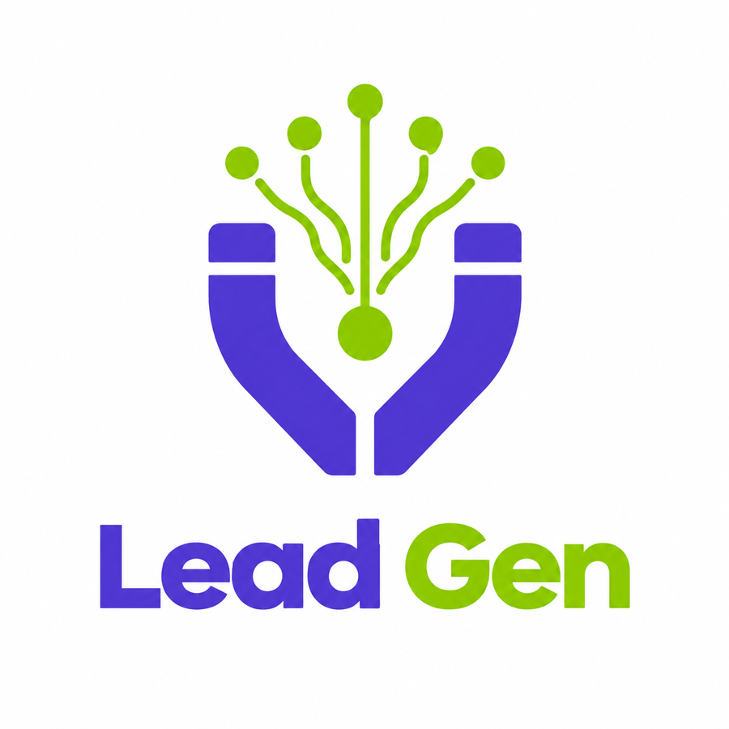
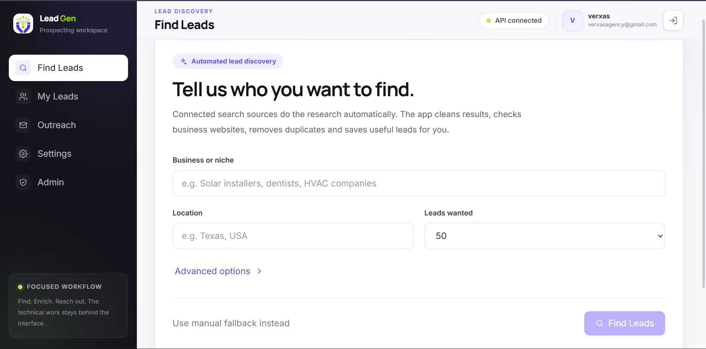
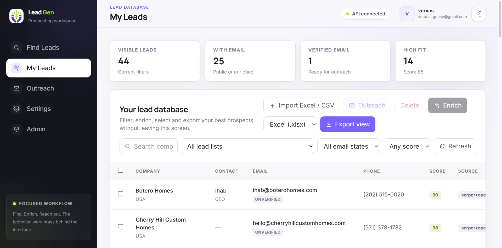
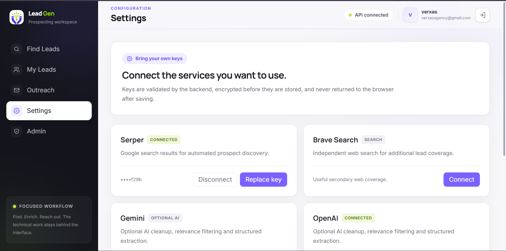
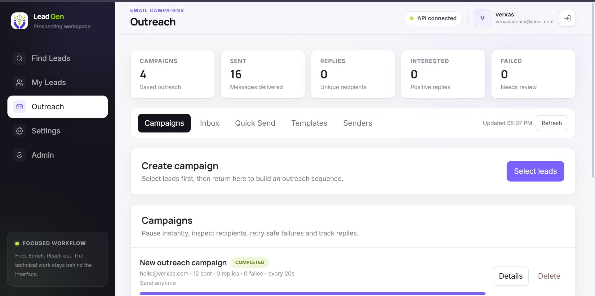
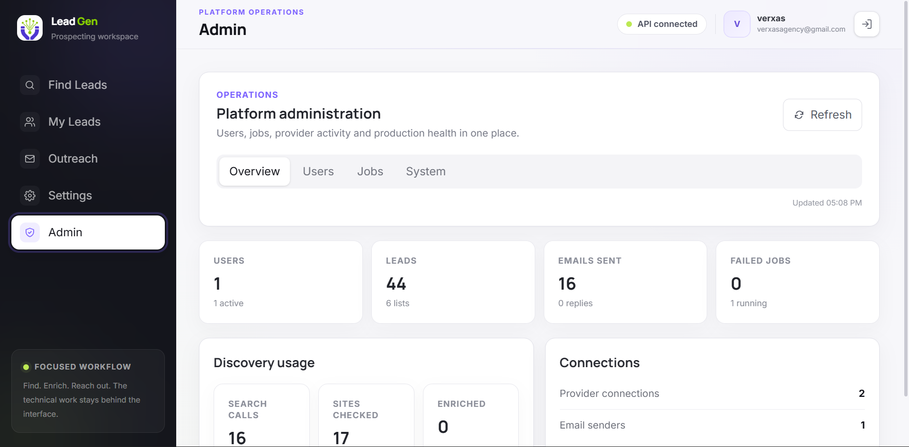

<div align="center">



# Lead Gen

### Find better prospects. Organize them. Reach out from one place.

**Lead Gen** is a free-first, BYOK lead discovery and outreach workspace built for freelancers, agencies, consultants, and small teams that want a practical way to find businesses, enrich contact data, manage leads, and run outreach without stitching together a dozen tools.

[**Open the live app**](https://lead-gen-web-rq8w.onrender.com) · [Repository](https://github.com/saifdevx/leads-agent)

</div>

---

## Why Lead Gen exists

Lead generation often starts with a surprisingly manual workflow:

1. search Google for businesses in a niche,
2. open websites and social profiles,
3. copy emails and phone numbers,
4. clean duplicates,
5. organize everything in a spreadsheet,
6. write outreach emails,
7. send and track them somewhere else.

Lead Gen brings that workflow into one focused application.

You can enter a niche and location, let the app research prospects using connected providers, review the results, enrich missing contact details, import or export spreadsheets, and move selected leads directly into an outreach campaign.

The interface is intentionally simple. Search providers, AI models, enrichment APIs, queues, workers, caching, and background jobs stay behind the scenes.

---

## Screenshots

### Automated lead discovery

Enter a niche, location, and target lead count. Lead Gen searches connected sources, checks public business websites, cleans the results, merges duplicates, and saves useful prospects.



### Lead database

Review, filter, enrich, import, export, bulk-select, and move prospects into outreach without leaving the lead table.



### BYOK integrations

Users can connect the services they already pay for. Provider credentials are validated by the backend and stored encrypted.



### Outreach workspace

Create templates, quick-send test messages, build campaigns, schedule follow-ups, inspect replies, and track campaign activity.



### Admin operations

Monitor users, leads, provider activity, jobs, email volume, and production health from one admin area.



---

## What it can do

### Lead discovery

- Search by **business niche + location**
- Automated search through **Serper** and optional **Brave Search**
- Google-style discovery queries for public business profiles and websites
- Public website crawling for emails, phones, social links, and business information
- Optional AI cleanup and relevance filtering using **OpenAI** or **Gemini**
- Business-level deduplication and record merging
- Lead scoring and high-fit filtering
- Durable background jobs for longer searches
- Manual fallback when an automated provider is unavailable

### Lead management

- Central **My Leads** database
- Search and filter by list, score, and email state
- Bulk selection and bulk deletion
- Smart enrichment
- Import from **Excel (.xlsx)** and **CSV**
- Export filtered or selected leads to **Excel** or **CSV**
- Source tracking so you know where a lead came from
- Verified/unverified email states instead of pretending every discovered address is verified

### Enrichment

Lead Gen follows a free-first approach:

```text
Public search
    ↓
Business website
    ↓
AI cleanup / relevance check
    ↓
Prospeo / Apollo when connected
```

Supported enrichment integrations include:

- **Prospeo**
- **Apollo**

The idea is simple: do not spend enrichment credits when useful data has already been found from public sources.

### Outreach

- Reusable email templates
- **Hostinger Agentic Mail** sender
- Optional Gmail sender support
- Quick Send for testing or one-off messages
- Campaign preview before anything is queued
- Explicit campaign approval
- Configurable daily limits
- 20-second+ send intervals
- Optional sending-hour windows
- Pause, resume, cancel, and delete controls
- Multi-step follow-up sequences
- Stop follow-ups when a lead replies
- Reply inbox and reply classification
- Suppression / unsubscribe handling
- Campaign analytics
- Failed-message review and safe retry controls

### Administration

Admin users can inspect:

- user accounts
- total leads and lists
- discovery activity
- sent email volume
- running / failed background jobs
- provider connections
- worker health
- system health

Admins can also suspend/reactivate users and retry eligible failed jobs.

---

## Bring Your Own Key

Lead Gen is designed around **BYOK (Bring Your Own Key)**.

Instead of forcing every user into one expensive provider, users can connect the services that make sense for them.

Current provider categories:

| Category | Providers |
| --- | --- |
| Search | Serper, Brave Search |
| AI | OpenAI, Gemini |
| Enrichment | Prospeo, Apollo |
| Email | Hostinger Agentic Mail, optional Gmail |
| Authentication | Firebase |
| Database | Turso |

Provider secrets are handled by the backend, encrypted before persistence, and never returned to the browser in plaintext.

---

## Typical use cases

Lead Gen is useful for workflows such as:

- a web-design agency finding local businesses with outdated websites,
- an AI automation agency prospecting companies in a specific vertical,
- a freelancer building targeted prospect lists,
- a marketing agency creating location-specific outreach lists,
- a consultant researching businesses and exporting qualified contacts,
- an operator importing an existing Excel sheet and running outreach from it.

Example:

```text
Niche: Home remodeling
Location: Texas, USA
Target: 50 leads

Lead Gen
  → searches connected sources
  → checks business websites
  → removes obvious duplicates
  → scores prospects
  → enriches selected records
  → exports them or sends them to Outreach
```

---

## Product philosophy

A few principles shape the project:

**Free-first.** Public data and low-cost sources should remain useful even without premium APIs.

**Simple outside, capable inside.** The user should think in terms of finding leads, reviewing them, and contacting them — not queues, jobs, provider waterfalls, or infrastructure.

**Evidence before invention.** AI is used to clean and structure retrieved information, not to fabricate contact details.

**Provider-independent.** Search, AI, enrichment, and mail services sit behind adapters so they can be replaced or extended later.

**Human approval before outreach.** Campaigns remain drafts until the user explicitly approves them.

---

## Tech stack

### Frontend

- React
- TypeScript
- Vite
- Tailwind CSS
- Firebase Web SDK

### Backend

- Python
- FastAPI
- Pydantic
- httpx
- XlsxWriter / openpyxl
- Firebase Admin SDK

### Data & infrastructure

- Firebase Authentication
- Turso database
- Render Static Site
- Render Web Service
- Embedded lead + outreach workers in the zero-cost deployment profile

### External integrations

- Serper
- Brave Search
- OpenAI
- Gemini
- Prospeo
- Apollo
- Hostinger Agentic Mail
- Gmail (optional)

---

## Architecture

```text
                         ┌──────────────────────┐
                         │      Lead Gen UI     │
                         │ React / Vite / TS    │
                         └──────────┬───────────┘
                                    │ HTTPS
                                    ▼
                         ┌──────────────────────┐
                         │      FastAPI API     │
                         │ Auth / validation /  │
                         │ orchestration        │
                         └──────┬───────┬───────┘
                                │       │
                   ┌────────────┘       └─────────────┐
                   ▼                                  ▼
            ┌─────────────┐                  ┌─────────────────┐
            │    Turso    │                  │ Embedded workers│
            │ application │                  │ search/outreach │
            │    data     │                  └────────┬────────┘
            └─────────────┘                           │
                                                     ▼
                      ┌──────────────────────────────────────────┐
                      │ Search / AI / Enrichment / Email APIs    │
                      │ Serper · Gemini/OpenAI · Apollo/Prospeo  │
                      │ Hostinger Mail                            │
                      └──────────────────────────────────────────┘
```

Firebase handles identity. Turso remains the application source of truth.

---

## Authentication and data ownership

Lead Gen currently supports:

- email/password authentication,
- Google sign-in,
- persistent Firebase sessions,
- server-side Firebase token verification.

The browser does not decide whether a user is authenticated. FastAPI verifies the Firebase ID token before protected application data is returned.

Application records are associated with the authenticated Firebase user.

---

## Local development

### Requirements

- Node.js compatible with the repository `.node-version`
- Python
- Firebase project
- Turso database

### Backend

```powershell
cd backend

python -m venv .venv
.venv\Scripts\Activate.ps1

pip install -r requirements.txt
python -m app.db.migrate
pytest -q

uvicorn app.main:app --reload --port 8000
```

Backend:

```text
http://127.0.0.1:8000
```

Health:

```text
http://127.0.0.1:8000/health
```

### Frontend

```powershell
cd frontend

npm install --include=optional
npm run check
npm run test
npm run build
npm run dev
```

Frontend:

```text
http://localhost:5173
```

### Local outreach worker

For local campaign delivery, keep another terminal open:

```powershell
cd backend
.venv\Scripts\Activate.ps1

python -m app.outreach.worker
```

Lead discovery can run inline locally depending on `BACKGROUND_JOBS_MODE`.

---

## Environment configuration

Real secrets must never be committed.

### Frontend

Typical `frontend/.env` variables:

```text
VITE_API_URL=
VITE_FIREBASE_API_KEY=
VITE_FIREBASE_AUTH_DOMAIN=
VITE_FIREBASE_PROJECT_ID=
VITE_FIREBASE_STORAGE_BUCKET=
VITE_FIREBASE_MESSAGING_SENDER_ID=
VITE_FIREBASE_APP_ID=
```

### Backend

Typical `backend/.env` values include:

```text
APP_ENV=
APP_VERSION=
CORS_ORIGINS=
FRONTEND_APP_URL=
PUBLIC_API_URL=

FIREBASE_PROJECT_ID=
FIREBASE_CREDENTIALS_PATH=
FIREBASE_SERVICE_ACCOUNT_JSON=

TURSO_DATABASE_URL=
TURSO_AUTH_TOKEN=
TURSO_TIMEOUT_SECONDS=

CREDENTIAL_ENCRYPTION_KEY=

ADMIN_EMAILS=
BACKGROUND_JOBS_MODE=
EMBEDDED_WORKERS=
WORKER_POLL_SECONDS=
WORKER_LEASE_SECONDS=
USER_ACCESS_CACHE_SECONDS=
QUICK_SEND_PER_MINUTE=
```

Optional Gmail variables are only needed when Gmail is used.

> **Important:** never regenerate `CREDENTIAL_ENCRYPTION_KEY` after encrypted provider or sender credentials have been stored. Existing encrypted credentials depend on it.

---

## Deployment

The production deployment currently uses Render's no-cost architecture:

```text
Render Static Site
    → Lead Gen frontend

Render Free Web Service
    → FastAPI
    → embedded lead worker
    → embedded outreach worker

Turso
    → durable application data

Firebase
    → authentication
```

### Live deployment

Frontend:

```text
https://lead-gen-web-rq8w.onrender.com
```

API:

```text
https://lead-gen-api-bp7i.onrender.com
```

Health endpoint:

```text
https://lead-gen-api-bp7i.onrender.com/health
```

### Free-tier trade-off

The free Render API can sleep after inactivity. Pending jobs live in Turso, so they are not intentionally discarded, but scheduled/background work can be delayed until the API wakes again.

For personal use and early testing this keeps hosting cost low. The repository also preserves a scaled deployment profile for a future always-on setup.

See `docs/PRODUCTION_DEPLOYMENT.md` for deployment details.

---

## Security decisions

Lead Gen includes several practical safety controls:

- Firebase ID tokens are verified server-side.
- Provider API credentials are encrypted at rest.
- Raw saved provider credentials are not returned to the browser.
- CORS is restricted to configured frontend origins.
- Production API docs are disabled.
- Security headers are applied by FastAPI.
- Quick Send has rate protection.
- Campaign sending requires explicit approval.
- Suppressed/unsubscribed addresses are blocked from future sending.
- User data access is scoped server-side.
- Durable background jobs keep state in Turso rather than relying on ephemeral files.

Do not commit:

```text
.env
Firebase Admin JSON
Turso tokens
Hostinger tokens
provider API keys
CREDENTIAL_ENCRYPTION_KEY
```

---

## Outreach responsibility

Lead Gen is a tool for legitimate prospect research and outreach. Users are responsible for following the laws, provider rules, and consent/opt-out requirements that apply to their audience and region.

The application includes suppression, unsubscribe handling, rate controls, and campaign approval because outreach should be deliberate — not a fire-and-forget spam engine.

---

## Current production status

The deployed application has been tested end-to-end for:

- authentication,
- automated lead search,
- lead persistence,
- templates,
- Hostinger email sending,
- exports,
- admin access,
- provider connections.

The application is actively usable.

---

## Roadmap

The core product is deliberately usable before adding more complexity.

Possible future directions include:

### Near term

- smarter template personalization and fallback business-name inference,
- richer HTML email rendering,
- more lead-quality tuning from real-world searches,
- additional production bug fixes discovered through usage.

### Integrations

- Google Places
- additional email-verification providers
- Instantly / Smartlead
- HubSpot
- Pipedrive
- other CRM systems

### Product expansion

- team workspaces
- agency/client workspaces
- role-based collaboration
- billing and subscription plans
- custom domains / white-labeling
- deeper provider cost tracking
- richer reply analytics
- meeting-booking workflows
- saved search recipes
- reusable ICP profiles

### Scale

- always-on dedicated workers
- higher-throughput queues
- production monitoring/alerting
- more advanced provider routing
- larger dataset optimizations

The architecture intentionally keeps provider-specific code behind adapters so these features can be added without rebuilding the application from scratch.

---

## Repository structure

```text
leads-agent/
├── backend/
│   ├── app/
│   ├── migrations/
│   ├── tests/
│   └── requirements.txt
│
├── frontend/
│   ├── public/
│   ├── src/
│   ├── package.json
│   └── vite.config.ts
│
├── docs/
│   ├── screenshots/
│   ├── PROJECT_CONTEXT.md
│   ├── PRODUCTION_DEPLOYMENT.md
│   └── FINAL_RELEASE_CHECKLIST.md
│
├── render.yaml
├── render-scaled.yaml
└── README.md
```

---

## Testing before a release

Backend:

```powershell
cd backend
.venv\Scripts\Activate.ps1

python -m app.db.migrate
pytest -q
```

Frontend:

```powershell
cd frontend

npm run check
npm run test
npm run build
```

Recommended smoke test:

1. Sign in.
2. Run a small automated lead search.
3. Review leads.
4. Export an XLSX.
5. Send a Quick Send test to an address you control.
6. Send a one-recipient campaign.
7. Verify replies / stop-on-reply when enabled.
8. Check Admin → System.

---

## Contributing / extending the project

When adding features:

1. preserve existing working flows,
2. put vendor-specific code behind an adapter where practical,
3. make database changes through migrations,
4. never put provider secrets in the frontend,
5. test the existing lead + outreach workflow before merging,
6. keep the user interface simpler than the backend architecture.

That last point matters most. Lead Gen should remain easy to understand even as the system becomes more capable.

---

## License

No open-source license has been selected yet.

If this repository will become public or accept outside contributions, add an explicit license before treating the code as open source.

---

<div align="center">

**Lead Gen**  
Built to turn lead research into a focused workflow instead of a pile of tabs and spreadsheets.

</div>
